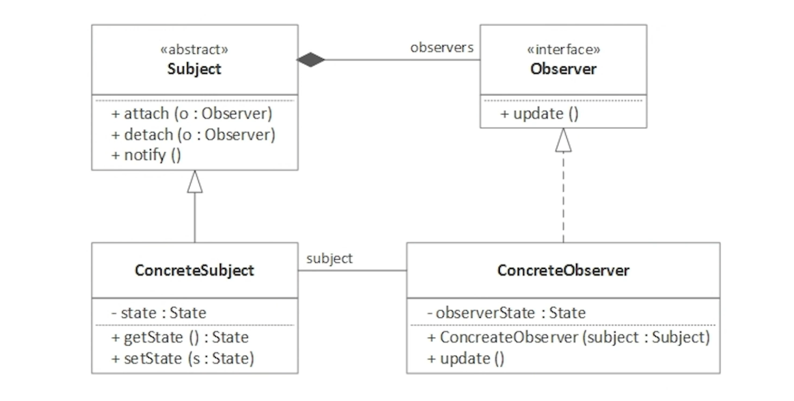
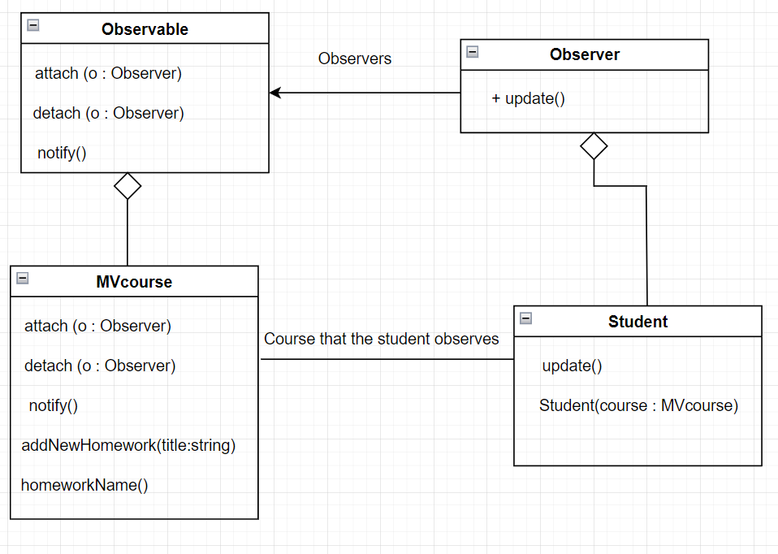
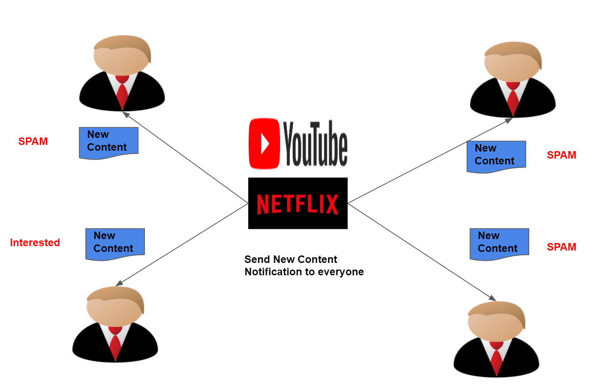

# **Investigación del patrón de diseño Observer**

## **Estudiantes:**

Fabio Andrés Sanabria Valerín C07194

**Correo:** fasav12@gmail.com

Esteban Iglesias Vargas C03913

**Correo:** Esteban.iglesias@ucr.ac.cr

## **Concepto**

El patrón Observer es un patrón de diseño de comportamiento que define una relación de uno a muchos entre objetos, de manera que cuando un objeto cambia de estado, este notifica y actualiza automáticamente a todos los objetos que dependen de él. [1]

Para entender mejor este patrón puede observar el siguiente diagrama creado por el ingeniero en software y creador de contenido Martin de Betta Tech en donde parece que se basó en el diagrama de GOF de Observer.

|Diagrama 1. Diagrama explicativo del patrón Observer creado por BettaTech basado en el diagrama de GOF [2]|
| :----------: |

## **Nombres:** 
***Observer, patrón Dependiente patrón Publicador/Suscriptor o patrón Evento/Manejador***, se le dice así porque refleja la relación entre el sujeto (publicador) que envía notificaciones y los observadores (suscriptores) que reciben y responden a esas notificaciones. [1]

## **Problema:** 

Existen diversos escenarios y contextos en donde se puede utilizar este patrón para conseguir eficiencia, eficacia y mejoría en el diseño de un sistema, es por eso que es indispensable conocer este patrón y usarlo cuando:

1. Cuando los cambios en el estado de un objeto deben propagarse a otros objetos sin acoplarlos explícitamente. Si un objeto necesita notificar a múltiples objetos sobre un cambio en su estado, el patrón Observer proporciona una solución eficiente y desacoplada. Esto evita acoplar directamente los objetos y permite una comunicación flexible y dinámica[1].
2. Cuando un cambio en un objeto requiere cambiar otros, y no sabemos cuántos y qué tipo de objetos necesitan cambiarse [1]

3. Cuando se necesita establecer una relación entre componentes en capas o módulos separados. Esto facilita la comunicación entre componentes o módulos que están separados en el espacio y el tiempo. Los observadores pueden estar ubicados en diferentes partes del sistema y seguir recibiendo notificaciones cuando ocurran cambios en el sujeto. [1]

## **Ejemplos:**

### **Ejemplo de mediación:**

Este ejemplo será el implementado en código, se desea implementar una funcionalidad en Mediación Virtual donde cada vez que un profesor de un curso en el que el estudiante esté inscrito añada una tarea, el sistema le notifique al estudiante que este a subido una nueva asignación. Además, si el estudiante retira el curso o es expulsado de este, él no puede recibir las notificaciones del curso. Para que el ejemplo anterior se pueda entender de una mejor manera, se creó un dibujo basado en el diagrama hecho por GOF en el libro Design Patterns sobre Observer:

|Diagrama 2. Diagrama macro del ejemplo anterior basado en diagrama de GOF y BettaTech|
| :----------: |

El anterior ejemplo se desea implementar para que se parezca a una funcionalidad ya implementada en mediación virtual, la cuál es la notificación de todos los estudiantes cuando un profesor realiza retroalimentación de una tarea. Aunque los programadores de mediación virtual lo más probable es que no hayan utilizado este patrón de diseño para implementar esa funcionalidad, lo cierto es que nos sirve de ejemplo para saber como funciona el patrón Observer de forma general. A continuacion se mostrará una imagen de la notificación de la revisión de una tarea en mediación virtual.

|Imagen 1. Imagen de cuando un profesor revisa una tarea y este notifica al los estudiantes del curso|
| :----------: |

### **Ejemplo de Youtube**

Otro ejemplo en donde se utiliza el patrón Observer es en Youtube, cuando una persona se suscribe a un canal de youtube, esta selecciona una opción para recibir notificaciones cuando el canal sube un video, en este caso el canal es el observado o sujeto y los suscriptores del canal son los observadores. Entonces, cada vez que el canal de youtube actualiza su estructura (o sea que se sube un nuevo video), este notifica a todos los suscriptores sobre el cambio de su estructura a través de un notify().

### **Ejemplo de Netflix**

El ejemplo de netflix es similar al de Youtube, cada vez que un usuario compra una suscripción de netflix, a este siempre le llegan notificación de las películas que acaban de meter o las películas que estan a punto de sacar de la aplicación. Esto es un claro ejemplo del patrón Observer ya que existen varios observadores **(Usuarios que pagarón la membresía)** y hay un sujeto u observable **(Cuenta de netflix donde estan todas las películas)**. Cada vez que haya un pequeño cambio en el catálogo de netflix, este notifica de forma **aleatoria** a todos los usuarios.

A continuación se motrará una imagen que explica de forma visual y simple como funciona el patrón observer en los anteriores ejemplos:

|Imagen 2. Imagen de cuando netflix y youtube notifica a todos los usuarios utilizando el patrón observer [4]|
| :----------: |

## **Solución:**

### **Sujeto:**

Es el objeto o sujeto que será observado por los observadores, mantiene una lista (agregar o attach y eliminar o detach) de las personas u observadores para notificar del cambio de estado, de igual manera, puede mantener un estado que puede ser consultado por los observadores.

**Se relaciona:** Manteniendo una lista de los observadores para saber a quienes notificar.

**Responsabilidad:** Notificar a los miembros de la lista

### **Observador:**

Puede ser una interfaz o clase que define a los observadores, contiene un método llamado comúnmente update que notifica sobre el cambio de estado, puede incluir información adicional sobre el mismo.

**Se relaciona:** Será miembro de la lista del sujeto que tiene interés en ser notificado.

**Responsabilidad:** Recibir el update para tomar más adelante decisiones sobre el cambio.

### **Observador Concreto:** 
Implementa la interfaz del observador y puede mantener una referencia del sujeto (esto puede variar entre implementaciones del método observer pero la original la mantiene), esto con el fin de realizar acciones cuando se realiza el update como tomar los datos desde el mismo sujeto.

**Se relaciona:** Implementa la clase o interfaz observador para ser un observador concreto.

**Responsabilidad:** Realiza acciones de acuerdo a la notificación, normalmente con su referencia al sujeto, obtiene los datos nuevos del mismo.

## **Relación con otros patrones:**

Se relaciona con el **patrón Mediator** ya que este puede actuar como un intermediario centralizado que coordina las comunicaciones entre los objetos observables y los observadores. En lugar de que los observadores se suscriban directamente a los objetos observables, se suscriben al Mediator, y este último se encarga de distribuir las notificaciones a los observadores relevantes. 

Otro patrón con el que se puede relacionar es el **Singleton** ya que la cola que utilizamos en el ejemplo de mediación virtual puede ser singleton para trabajar con una sola instancia de esta.

## **Consecuencias:**

Si aplicamos este patrón hay que tener en cuenta los beneficios y desventajas que esto acarrea, en algunas ocasiones puede mejorar la eficiencia del producto pero vuelve más complejo el código, a continuación se mencionan diferentes objetivos o ventajas que logramos obtener y los trade-off o desventajas que tenemos que “pagar” por hacer uso del patrón Observer:

### **Objetivos o ventajas:**

1. **Desacoplamiento:** Permite desacoplar el sujeto observable y los observadores, lo que significa que pueden interactuar sin estar estrechamente acoplados. Los observadores no necesitan conocer los detalles internos del sujeto observable y viceversa [1].

2. **Fomenta el cumplimiento del principio SOLID:** Permite extender el sistema con nuevos observadores sin modificar el sujeto observable. Esto facilita la adición de nuevas funcionalidades sin afectar el código existente volviéndo flexible y mantenible.

3. **Fomenta el cumplimiento del principio KISS:** Promueve la simplicidad y la claridad del diseño al separar las responsabilidades y evitar el acoplamiento directo entre el sujeto observable y los observadores. Cada componente tiene una única tarea y no hay dependencias complicadas entre ellos..

4. **Actualización en tiempo real:** El patrón Observer permite que los observadores reciban actualizaciones en tiempo real cuando se producen cambios en el sujeto observable. Esto es especialmente útil en situaciones donde es necesario mantener los objetos sincronizados y reflejar los cambios de manera inmediata.

### **Trade-off:**

1. **Complejidad adicional**: La implementación de este patrón puede añadir una complejidad adicional en el diseño y la estructura del sistema. Se requiere establecer y mantener la relación entre los sujetos observables y los observadores, lo que puede aumentar la complejidad y el esfuerzo de desarrollo.

2. **Sobrecarga de rendimiento**: Si hay muchos observadores registrados con el sujeto observable y se producen cambios frecuentes en el estado del sujeto, puede empeorar el rendimiento del programa debido a la notificación y actualización de todos los observadores.

3. **Posible falta de control de secuencia**: Dependiendo de cómo se implemente el patrón Observer, puede haber una falta de control de secuencia en la notificación de los observadores, es decir, los observadores son notificados de forma aleatoria. Esto podría causar problemas si el orden de notificación es crucial para el sistema [3].

## **Implementación:**

### **Evitar y trampas:**

- Eliminar las referencias de los sujetos en la lista antes de eliminarlo del todo, esto para evitar problemas de memoria y notificaciones a sujetos no existentes.

- Gestionar bien la lista de observadores para no tener múltiples referencias al mismo sujeto y notificar múltiples veces (indeseadas).

### **Sugerencias y técnicas:**

- Añade que se pueda hacer “Attach” y “Detach” de manera dinámica en tiempo de ejecución, esto permite flexibilidad y extensibilidad.

- Añadir mecanismos de notificaciones específicas, esto para que solo se suscriban a aquellos sujetos que les interesan.

- Realizar agrupación de notificaciones en casos de múltiples cambios en cortos periodos de tiempo. Se puede usar con una cola o temporizador para agrupar las notificaciones y actualizaciones, puede mejorar el rendimiento en situaciones de múltiples cambios en cortos periodos de tiempo.

- Gestionar bien las notificaciones para que solo sean notificaciones relevantes y evitar actualizaciones innecesarias.

## **Ejemplo en código**

Recuerda el ejemplo sobre mediación virtual que se planteó anteriormente, pues se logró implementar en python utilizando el patrón Observer. 

Si desea ver el código y probarlo tenga en cuenta las siguientes indicaciones:

1. Instalar dependencias de python

2. Luego irse a la carpeta con el src (Ejemplo de path: **C:\Users\fasav\OneDrive\Desktop\UCR\Primer semestre 2023\Diseño\ObserverPattern\ObserverCode\src>**) 

3. Compilar con el botón de **play** ▶️ de Visual Studio o utilizando el comando **python observer.py**

### **Enlace para ver el código:**

[Carpeta con el código en python](/software-design/docs/patterns/comportamiento/ObserverPattern/ObserverCode/src/observer.py)

## Presentación

### **Enlace para ver el código:**

Presentación utilizada en clase para exponer el patrón, tiene imágenes del ejemplo en código y elementos más detallados y visuales

[Presentación Observer](/software-design/docs/patterns/comportamiento/ObserverPattern/ObserverCode/Presentation/ObserverPresentation.pdf)

## **Bibliografía**
[1] Helm, R., Gamma, E., Vlissides, J., & Johnson, R. (2005). *Design Patterns*. Addison Wesley

[2] BettaTech. (2020, 26 de septiembre). *OBSERVER (El PATRÓN que lo ve TODO) | PATRONES de DISEÑO* [Video]. YouTube. https://www.youtube.com/watch?v=HFkZb1g8faA

[3] Observer". *Refactoring and Design Patterns*. https://refactoring.guru/design-patterns/observer.

[4] Gaitonde, A. (2021). Observer Design Pattern — Explained In Five Minutes. https://medium.com/swlh/observer-design-pattern-explained-in-five-minutes-c01113666318

