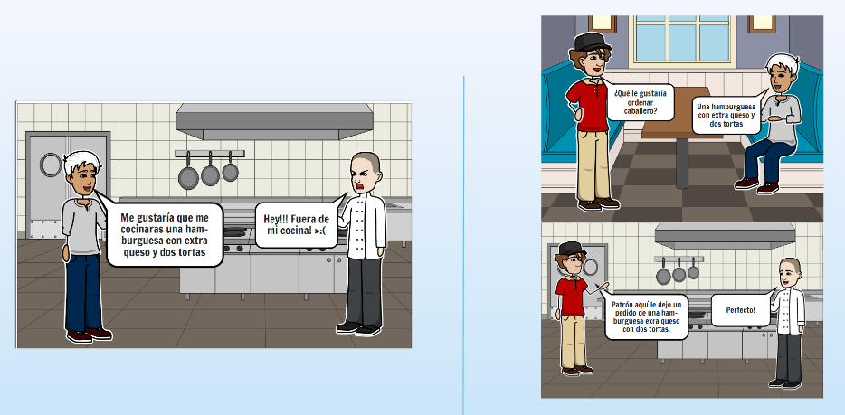
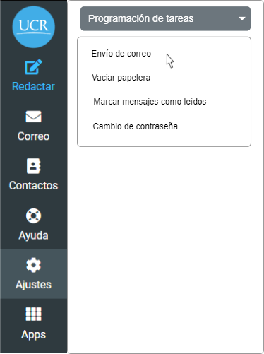
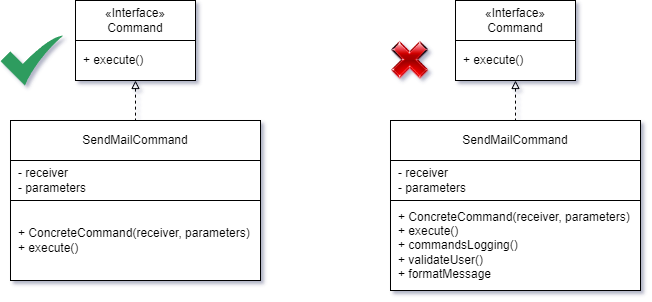
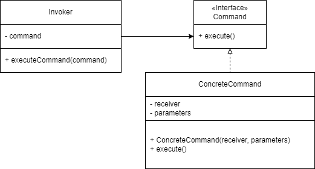

# Patrón Command

Para ver una presentación en formato `pdf` descargue el archivo [command.pdf](./command.pdf)

## 1. Integrantes

- Ángel Chaves Chinchilla C12113  
angel.chaveschinchilla@ucr.ac.cr

- Camilo Suárez Sandí C17811
camilo.suarez@ucr.ac.cr

## 2. Descripción

El patrón *Command* puede ser clasificado como un patrón de comportamiento, esta clasificación corresponde a una de las tres categorías descritas por la “Gang of Four” en su libro de Design Patterns. De acuerdo a estos autores:
> "El patrón Command encapsula una solicitud como un objeto, lo que le permite parametrizar otros objetos con diferentes solicitudes, poner en cola o registrar solicitudes y admitir operaciones que se pueden deshacer."

Para entenderlo mejor, podemos utilizar una analogia de la vida real, por ejemplo, imaginemos que estamos en un restaurante. El proceso para ordenar la comida no involucra tener un contacto directo, es decir, no nos comunicamos directamente con el chef. Si no que primero tenemos un contacto con el mesero al cual le indicamos los parámetros de nuestra orden y el mesero es el encargado de llevar nuestra orden al chef el cuál sabe ejecutarla. Veámolo en las siguientes secuencias:

De esta forma, nosotros nos desentendemos de la orden (o solicitud), la encapsulamos utilizando al mesero y el chef se encarga de ejecutarla.

Ahora supongamos que además de nosotros, hay una familia entera también solicitando la comida. El mesero lleva la solicitud mía y la de la familia al chef. Pero el chef no puede procesarlas aún, entonces están se ponen en espera, se colocan en una cola para que después sean procesadas.

Además pensemos en que la comida que nos trajeron no fue lo que pedimos, podríamos pedirle al chef (mediante el mesero) que por favor nos haga una nueva (proceso de deshacer y hacer una nueva).

## 3. Problema

## 4. Solución

## 5. Ejemplo en código

## 6. Implementación

### 6.1 Pasos de implementación

### 6.2 Aplicabilidad

* Cuando se desee parametrizar objetos con operaciones: El patrón Command puede convertir una llamada de método específico en un objeto independiente. Este cambio abre muchos usos interesantes: puede pasar comandos como argumentos de método, almacenarlos dentro de otros objetos, cambiar comandos vinculados en tiempo de ejecución, etc.

Por ejemplo, en una aplicación de edición de imágenes le asignaríamos a cada botón un comando específico en el momento de su creación. Pero también podríamos cambiarle este comando por uno más especializado.

* Utilice el patrón Command cuando desee poner en cola operaciones, programar su ejecución o ejecutarlas de forma remota. Por ejemplo, si en el sistema de Correo UCR quisieramos dar la oportunidad a los usuarios de programar el envío de correos cada cierto tiempo, o que la papelera se vacíe pasados unos días, ...., podríamos poner nuestroa comandos en una cola de espera y se ejecuten después de un tiempo. Para esto se requiere conocer el paradigma de programación orientado a eventos.

* Utilice el patrón Command cuando desee implementar operaciones reversibles.

## 7. Consecuencias

### 7.1 Ventajas

* Facilita la implementación de operaciones deshacer/rehacer.
* Promueve la extensibilidad y la flexibilidad del código.
* Puede implementar la ejecución diferida de operaciones (colas y registros de comandos).

### 7.2 Desventajas

* El código puede volverse más complicado ya que está introduciendo una capa completamente nueva entre remitentes y receptores.

## 8. Principios de diseño

### 8.1 SOLID

* Principio de responsabilidad única (SRP):

Cada comando tiene la responsabilidad de encapsular una operación específica y ejecutarla cuando sea necesario. Podría incumplirse si un comando también se encarga de realizar operaciones adicionales, como el registro de eventos, la notificación de otros objetos o la gestión del estado.

* Principio de Open/Closed (OCP)

Cumple con este principio al permitir la extensibilidad del código sin modificar el código existente. Se pueden agregar nuevos comandos sin alterar los objetos invocadores o los objetos receptores existentes. No se estaría cumpliendo si se debe estar modificando el objeto invocador o también la interfaz ICommand cada vez que se agreguen nuevos comandos.

* Principio de segregación de interfaces:

Cumple con este principio al definir una interfaz específica para los comandos. Cada comando implementa sólo los métodos necesarios para ejecutar la acción solicitada, evitando así la dependencia de métodos innecesarios. Podría incumplirse si se agregan métodos innecesarios a la interfaz.

* Principio de inversión de dependencia:

Cumple con este principio al permitir que los objetos invocadores no dependan directamente de los objetos receptores o de los comandos concretos. Los objetos invocadores solo conocen la interfaz común del comando.

### 8.2 DRY (Don't repeat yourself)

El patrón busca encapsular una solicitud en un objeto de comando, lo cual ayuda a evitar la duplicación de código relacionado con esa solicitud específica. El código que invoca la solicitud puede hacerlo a través de un objeto de comando sin tener que conocer los detalles específicos de la implementación.

Sin embargo, puede haber casos en los que la lógica dentro de los diferentes objetos de comando pueda duplicarse. Por ejemplo, si varios comandos realizan operaciones similares pero con variaciones menores, puede haber duplicación de código en las implementaciones de los comandos individuales.

### 8.3 (Keep it simple stup..)

En el caso del patrón Command, se puede argumentar que cumple parcialmente con el principio KISS. El patrón en sí mismo es relativamente simple, ya que se basa en la idea de encapsular una solicitud en un objeto de comando. Esto permite desacoplar el remitente de la solicitud del receptor, lo cual puede simplificar la lógica del código.

Sin embargo, a medida que se aplica el patrón Command en situaciones más complejas, puede introducir cierta complejidad adicional. Por ejemplo, puede requerir la creación de múltiples clases de comandos para representar diferentes operaciones, y la gestión de la cola de comandos puede agregar una capa adicional de complejidad.

### 8.4 OOP

Encapsulamiento: El patrón permite encapsular una solicitud en un objeto individual.
Abstracción: El patrón Command utiliza interfaces o clases base abstractas para representar los comandos,  lo que permite crear diferentes implementaciones de comandos para diferentes tipos de solicitudes.
Polimorfismo: Permite que los comandos concretos sobreescriban los métodos definidos en la interfaz.

## 9. Relación con otros patrones

* Cadena de responsabilidad: Pasa una solicitud secuencialmente a lo largo de una cadena dinámica de receptores potenciales hasta que uno de ellos la maneja.
* Observer: Permite a los receptores *Receivers* suscribirse y darse de baja dinámicamente de las solicitudes de recepción.
* Memento: Se puede usar con Command para implementar undo. Los Commands realizan varias operaciones sobre un objeto destino y los Memento guardan el estado de ese objeto.
* Prototype: Puede ayudar cuando necesite guardar copias de Comandos en el historial

# Referencias

Refactoring Guru. (s.f.). Command. Recuperado de https://refactoring.guru/design-patterns/command

Gamma, E., Helm, R., Johnson, R., & Vlissides, J. (1995). Design Patterns: Elements of Reusable Object-Oriented Software. Addison-Wesley.

DigitalOcean. (s.f.). Command Design Pattern. Recuperado de https://www.digitalocean.com/community/tutorials/command-design-pattern

Spring Framework Guru. (s.f.). Command Pattern. Recuperado de https://springframework.guru/gang-of-four-design-patterns/command-pattern/

Banas, D. (2012, 10 de octubre). Design Patterns: Command Pattern [Video]. YouTube. Recuperado de https://www.youtube.com/watch?v=9qA5kw8dcSU

