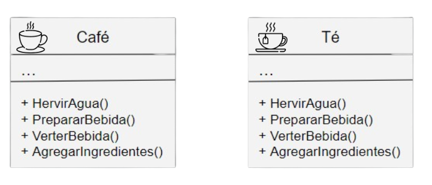

# Problema

### **¿Cuándo tiene sentido utilizar el patrón Bridge?**

El patrón Template Method tiene sentido utilizarlo cuando se desee que un cliente pueda extender únicamente algunos pasos de un algoritmo, pero siempre siguiendo una misma estructura. Por medio de este patrón se puede identificar un algoritmo monolítico y separarlo en varios pasos que se pueden extender en diferentes clases concretas.

Por otra parte, este patrón resulta útil cuando se identifican muchas clases con algoritmos casi idénticos, pero que se diferencian en muy pocos pasos, por lo tanto, cuando se convierte un algoritmo en un método plantilla, entonces se pueden encapsular dichos pasos con implementaciones similares a una superclase.

Vamos a definir dos ejemplos que ayudará a visualizar su utilidad, uno relacionado con bebidas calientes y un problema relacionado dentro de un contexto de la UCR:

### **Problema de bebidas calientes**

Digamos que se tiene un restaurante donde se sirven bebidas calientes, para preparar estas bebidas calientes se debe seguir algunos pasos que se repiten para varias bebidas calientes, pero otros pasos son completamente únicos. El problema es que para cada bebida caliente se está repitiendo mucho código y es difícil implementar una nueva bebida caliente, es por esto que se opta por el patrón de diseño Template Method.

A continuación puede visualizar la [solución](./Solucion.md/#solución-para-problema-de-las-bebidas-calientes) al problema descrito

### **Problema dentro de un contexto de la UCR**

Dentro de Mediación Virtual, a lo largo del año, se crean muchos entornos para diferentes cursos, ya sean de ingeniería, derecho, artes, etc; como se puede suponer, al momento de crear estos entornos para los distintos cursos se tendría que generar código que puede ser diferente para cada entorno o por lo contrario, bastante similar, esto puede ser contraproducente si no se maneja correctamente, ya que se puede llegar a tener mucho código duplicado y puede llegar a complicarse, si no se tiene una estructura definida. 

En este sentido, se obtendrá el siguiente resultado, en donde se define un curso de matemática, computación e inglés que no dependen de ninguna clase, pero que no poseen una estructura definida.

A continuación puede visualizar la [solución](./Solucion.md/#solución-para-problema-de-la-ucr) al problema descrito

[Regresar al Readme](./../README.md)