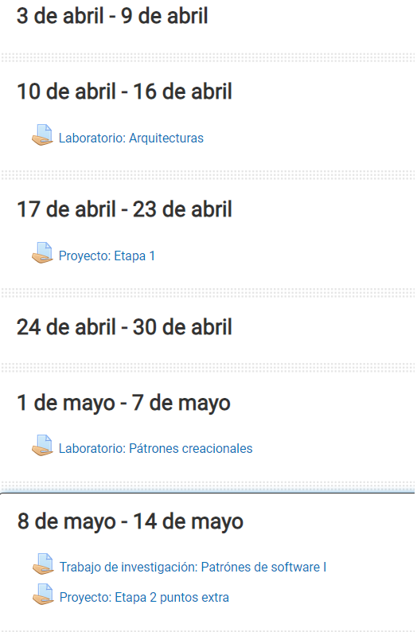
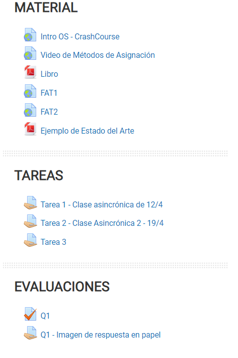
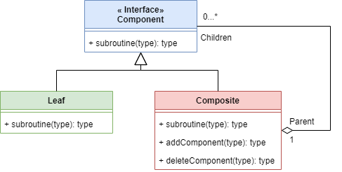

# Patrón Composite

Estudiantes:

- Julio Rodriguez Salguera C16717
- Geancarlo Rivera Hernández C06516

## Problema

Este patrón es muy útil cuando nuestros elementos poseen una estructura jerárquica entre ellos, dado que captura la esencia de la composición recursiva en términos orientados a objetos, ya que permite almacenar grupos de elementos complejos y simples en un mismo objeto, lo que se puede representar como una estructura de árbol. Esto posibilita simplificar el diseño y volver más conciso el código de una clase compleja, gracias a la modularidad que ofrece este patrón y la funcionalidad de poder tratar objetos individuales y compuestos de forma uniforme. (Haythornwaite, 2002, p. 163).

Un ejemplo familiar sobre la funcionalidad y utilidad de este patrón se da en la plataforma virtual “Mediación Virtual” de la Universidad de Costa Rica, específicamente con la funcionalidad de las secciones de los cursos virtuales, los cuales separan los recursos de forma física y lógica según temas (**figura 1**), fechas (**figura 2**), importancia o funcionalidad (**figura 3**). Estas secciones pueden contener una cantidad indefinida de recursos, como archivos o evaluaciones, y si una acción es realizada sobre la sección, puede ser transmitida a todos los recursos que este contiene, como por ejemplo, si este es ocultado, todos los recursos también desaparecerán. Además, estas secciones pueden contener carpetas de recursos (**figura 4**), por lo que si la sección es eliminada, la carpeta eliminará recursivamente todos sus contenidos. Este ejemplo muestra cómo el patrón composite puede simplificar el diseño y hacer más conciso el código de una clase compleja, lo que permite tratar objetos individuales y compuestos de forma uniforme.

**Figura 1: Secciones divididad por tema**

**Figura 2: Secciones divididad por fecha**

**Figura 3: Secciones divididad por función**

**Figura 4: Carpetas de recuros de Mediación Virtual**

Uno de los ejemplos más claros de este patrón son los sistemas de almacenamiento por carpetas y archivos; Al crear una carpeta, esta se encuentra vacía, pero dentro de ella se pueden crear un archivos o más carpetas como el mostrado en la **figura 5**, por lo que las carpetas funcionan como un objeto “contenedor”. Por otra parte, los archivos no pueden contener carpetas ni otros archivos dentro de ellos, convirtiéndolos en objetos “hoja”. Esta facultad de poder almacenar recursivamente objetos contenedores unos dentro de otros de forma indefinida y sencilla forma un árbol recursivo, lo que es una característica importante del patrón. Sumado a esto, otra capacidad que tiene el patrón Composite es la de simplificar el llamado a subrutinas heredadas, pues este llamado sólo debe realizarse para el componente contenedor más alto en la jerarquía (objeto padre/raíz), pues este se encarga de pasar el mensaje a sus contenidos (objetos derivados/hijos). Por ejemplo, cuando se elimina una carpeta, esta llamará a su subrutina de borrado para cada uno de sus elementos internos y estos a su vez llamarán a sus propias subrutinas de borrado recursivamente. (El patrón Composite: ejemplos de soluciones para jerarquías parte-todo, 2020).

**Figura 5: Estructura de carpetas y archivos**

## Solución

El patrón Composite utiliza y se basa en tres componentes principales para definir e implementar su estructura, que pueden ser observados en el diagrama UML de la **Figura 6**:

**Figura 6: Diagrama UML del patrón Composite**

### Component 🧰

Esta clase declara la interfaz de la cual van a heredar los objetos en la composición, es decir, *Leaf* y *Composite*. Además, es el responsable de implementar el comportamiento predeterminado para la interfaz común a todas las clases, las cuales deben implementarlo según corresponda. Declara una interfaz para acceder y administrar sus componentes secundarios y de forma opcional, puede  definir también una interfaz para acceder al padre de un componente en la estructura recursiva y la implementa si es apropiado. (Haythornwaite, 2002, p. 165).

### Composite 🛍️

Esta clase hereda de *Component* y es donde se encuentra la mayor lógica del patrón ya que define el comportamiento de los componentes que tienen hijos, puede almacenar una cantidad indefinida de componentes secundarios que hereden de la clase *Component*, teniendo la posibilidad de almacenar objetos de su mismo tipo *Composite* formando una composición recursiva. Es común que esta clase implemente una estructura de datos para guardar estos objetos de la composición. Además, esta clase debe implementar las operaciones o subrutinas relacionadas a los hijos definidas en la interfaz *Component*. (Haythornwaite, 2002, p. 165).

### Leaf 🍃

Esta clase también hereda de *Component* y representa los objetos hoja en la composición, definiendo el comportamiento de estos objetos primitivos, los cuales heredan las subrutinas necesarias de *Component* e implementan su propia versión de estas en caso de que no puedan utilizar la ya definida por *Component*. Estos objetos pueden, y normalmente están contenidos en un objeto *Composite*, además un cliente puede llamar a sus métodos individualmente. Cabe destacar que al ser una clase hoja, representan la clase más baja de la jerarquía por lo que no pueden contener otras clases que hereden de esta. (Haythornwaite, 2002, p. 165).

### Client 🧑‍💻

Más que una clase es un cliente que manipula los objetos de la composición a través de la interfaz *Component*. Si hace el llamado a un componente Leaf, este realizará la acción individualmente, pero si lo hace con un *Composite*, este hará el llamado recursivo a todos los objetos que formen parte de esa composición.

Lo anterior se puede ejemplificar con un sistema de archivos y directorios, en el que si por ejemplo, un usuario elimina un archivo (representando un objeto *Leaf*), este se eliminará individualmente, pero si elimina una carpeta (representando un objeto *Composite*) entonces esta llamará a eliminar recursivamente todos los archivos y subcarpetas dentro de ella.
