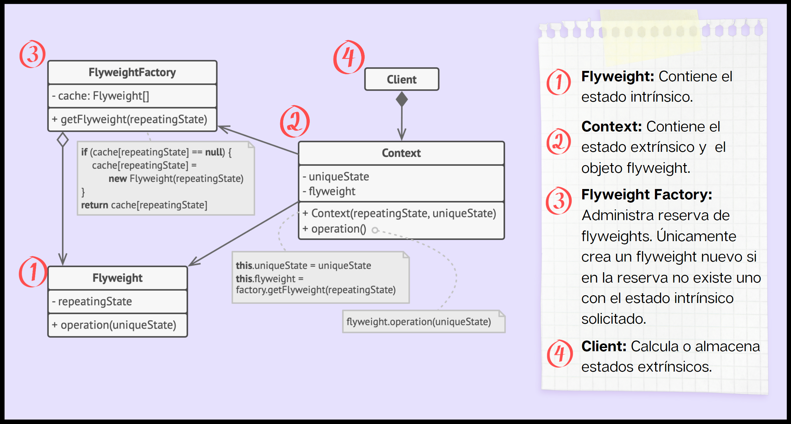
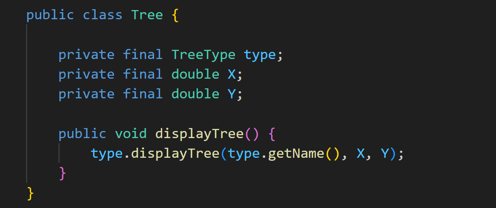
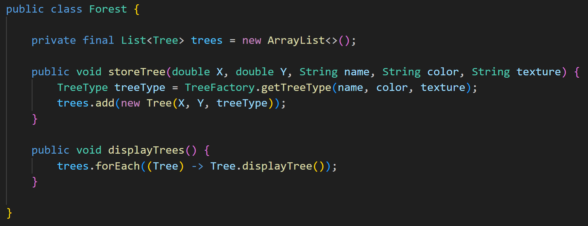

# Patrón Flyweight

Presentación PDF: [Flyweight Pattern](./flyweight_pattern.pdf)

## Problema
En la creación de aplicaciones de software, el manejo eficiente de memoria es una de las principales metas, lograrla se vuelve un desafío cuando se lidia con un gran número de objetos. Sin una estrategia efectiva que contemple los atributos contextuales de cada objeto, la creación y manipulación de estos puede conducir a saturación de memoria, un rendimiento lento y caídas de sistema.
## Solución
## Estados
## Flyweight
## Estructura

**Estructura del patrón flyweight**

1.  **Flyweight:** Contiene estado intrínseco que puede ser compartido entre múltiples objetos. Puede ser utilizado en diferentes contextos.  Usualmente contempla el comportamiento del objeto original (no dividido en estados), este recibe en sus parámetros el estado extrínseco.
 
2.	**Contexto:** Representa el objeto completo al contener el estado intrínseco y el objeto flyweight.
	
3.	**FlyweightFactory:** Pensado para utilizar por el cliente. Este maneja y administra la reserva de flyweights. Crea nuevos flyweights únicamente cuando no exista uno con los mismos atributos solicitados en reserva.

4.	**Client:** Usa el FlyweightFactory, calcula o almacena los estados extrínsecos.

## Estructura del ejemplo
En este ejemplo se descompone el objeto **“Árbol”** en estados intrínseco y extrínseco.

**Estructura del ejemplo de patrón Flyweight**

1.	**Flyweight (TreeType):** El estado intrínseco está compuesto por Nombre, Color y Textura. El método displayTree(X,Y) recibe coordenadas para dibujar el árbol en el mapa, estas coordenadas son el estado extrínseco.

2.	**Contexto(Tree):** El objeto Tree contiene el estado extrínseco (coordenadas) y un flyweight; formando así un objeto completo.

3.	**FlyweightFactory(TreeFactory):** Devuelve y administra objetos flyweight (TreeType).

4.	**Client(Forest):** Almacena objetos completos (Tree). Hace uso del FlyweightFactory.

## Implementación del ejemplo en Java

**Flyweight**

**Context**

**Factory**

**Client**

## Pasos de Implementación

1.	**Comprobar el rendimiento:** Asegurarse que el programa satura la memoria RAM, de lo contrario la implementación del patrón se considera no adecuada.

2.	**Separar objeto en estados:** Separar el objeto original en estados Intrínsecos (compartibles) y extrínsecos (únicos y cambiantes).

3.	**Crear FlyweightFactory:** Diseñar e implementar clase que almacene objetos flyweight únicos.

4.	**Crear cliente:** Diseñar e implementar clase cliente que utilice el FlyweightFactory. Adicionalmente el cliente se encarga de calcular o administrar los estados extrínsecos para uso con el patrón.

## Flyweight en la UCR
## Consecuencias
## Patrones relacionados
## Referencias

* Refactoring.Guru. (2023). Flyweight. Refactoring.Guru. https://refactoring.guru/design-patterns/flyweight
* Geekific. (2022, January 22). The Flyweight Pattern Explained and Implemented in Java | Structural Design Patterns | Geekific [Video]. YouTube. https://www.youtube.com/watch?v=qscOsQV-K14
