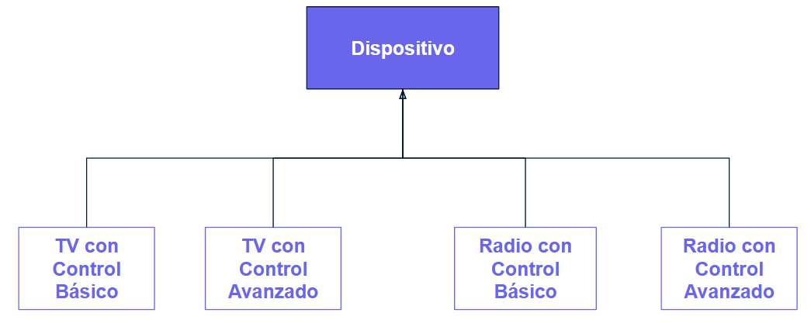
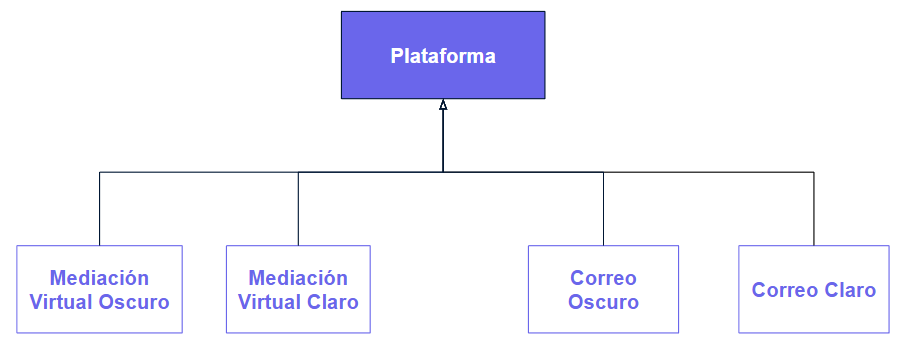

# Problema

### **¿Cuándo tiene sentido utilizar el patrón Bridge?**

El patrón Bridge tiene sentido utilizarlo cuando se desee separar y ordenar una clase monolítica que tenga múltiples variaciones de una misma funcionalidad. A medida que una clase crece, se vuelve más complicado entender cómo funciona y se toma más tiempo a la hora de realizar un cambio. Si se desea tomar la decisión de cambiar una de las variantes de la funcionalidad, esta puede requerir una gran cantidad de cambios, lo que normalmente conlleva a que se cometan errores o en la omisión de algunos de los efectos colaterales críticos.

Por otro lado, tiene sentido utilizar el patrón Bridge cuando se necesite extender una clase en múltiples dimensiones ortogonales, es decir, que sean independientes entre sí, ya que este patrón sugiere crear una jerarquía de clase separada de cada una de las dimensiones. La clase original debería delegar las tareas a los objetos pertenecientes a dichas jerarquías, no realizar todo el trabajo por su cuenta. 

Y por último, tiene sentido utilizar el patrón Bridge cuando se vea la necesidad de cambiar las implementaciones durante el tiempo de ejecución, por ejemplo, este patrón permite sustituir el objeto de implementación dentro de la abstracción.

Vamos a definir dos ejemplos que ayudará a visualizar su utilidad, uno relacionado con controles remotos y dispositivos, así como un relacionado dentro de un contexto de la UCR:

### **Problema de controles remotos**

Digamos que se tiene una clase Dispositivo con un par de subclases como por ejemplo: TV y Radio. Se desea extender estas clases para que incorporen diferentes controles remotos, entonces se planea crear las subclases Control Básico y Control Avanzado, sin embargo como ya se tienen dos subclases TV y Radio, entonces se deben crear cuatro combinaciones, como TV_Control_Básico, TV_Control_Avanzado, Radio_Control_Básico y Radio_Control_Avanzado.

### **Problema dentro de un contexto de la UCR**

Digamos que se tiene una clase Plataforma con un par de subclases como por ejemplo: Correo UCR y Mediación Virtual. Se desea extender estas clases para que incorporen diferentes temas de interfaz, entonces se planea crear las subclases Claro y Oscuro, sin embargo como ya se tienen dos subclases Correo UCR y Mediación Virtual, entonces se deben crear cuatro combinaciones, como CorreoUCR_Claro, CorreoUCR_Oscuro, MediacionVirtual_Claro y MediacionVirtual_Oscuro.

Como podemos observar si se desean añadir más temas de interfaz y más plataformas esto puede llegar a crecer de manera exponencial y esta no es la solución más óptima.

A continuación se puede visualizar la [solución](./Solucion.md) para los problemas descritos

[Regresar al Readme](./../README.md)

