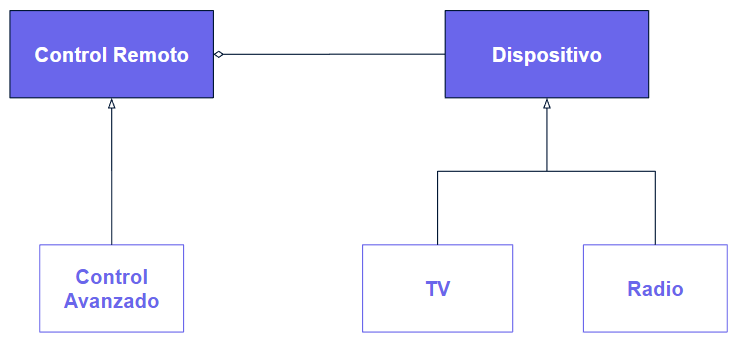

# Solución

### **Solución para problema de los controles remotos**
Para generar una solución más óptima al [problema de los controles remotos](./Problema.md) podemos utilizar el patrón Bridge, ya que permitirá separar las clases Dispositivo y Control, de esta manera se obtendrán dos clases independientes en la que una está compuesta de la otra y cada una posee su propia implementación, por lo que los cambios que se realicen en una clase no afectarán a la otra y viceversa.

Por lo que con este patrón, es posible separar el código asociado con Dispositivo en su propia clase, con dos subclases TV y Radio y el código asociado con Control posee un campo de referencia que apunta a uno de los objetos de Dispositivo. De esta manera, la clase Control puede delegar el trabajo relacionado con los dispositivos al objeto que se encuentra vinculado con los diferentes dispositivos. Este objeto dentro de la clase del control remoto  actuará como un puente entre las clases Dispositivo y Control.

Para observar un ejemplo de implementación dirijasé a la siguiente [código](./../src/bridgeExample.py)

### **Solución para problema de la UCR**
Para generar una solución más óptima al [problema de la UCR](./Problema.md) podemos utilizar el patrón Bridge, ya que permitirá separar las clases Plataforma y TemaInterfaz, de esta manera se obtendrán dos clases independientes en la que una está compuesta de la otra y cada una posee su propia implementación, por lo que los cambios que se realicen en una clase no afectarán a la otra y viceversa.

Por lo que con este patrón, es posible separar el código asociado con TemaInterfaz en su propia clase, con dos subclases Claro y Oscuro y el código asociado con Plataforma posee un campo de referencia que apunta a uno de los objetos de TemaInterfaz. De esta manera, la clase Plataforma puede delegar el trabajo relacionado con los temas al objeto que se encuentra vinculado con la apariencia de los temas de la interfaz. Este objeto dentro de la clase de las plataformas de la UCR actuará como un puente entre las clases Plataforma y TemaInterfaz, que permitirá añadir y modificar los colores de la interfaz que se está diseñando, sin involucrar a la clase Plataforma para este fin.

Para observar un ejemplo de implementación diríjase a la siguiente [código](./../src/bridgeUCR.py)

[Regresar al Readme](./../README.md)
