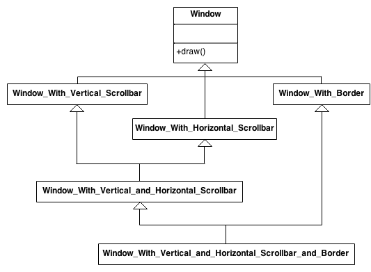
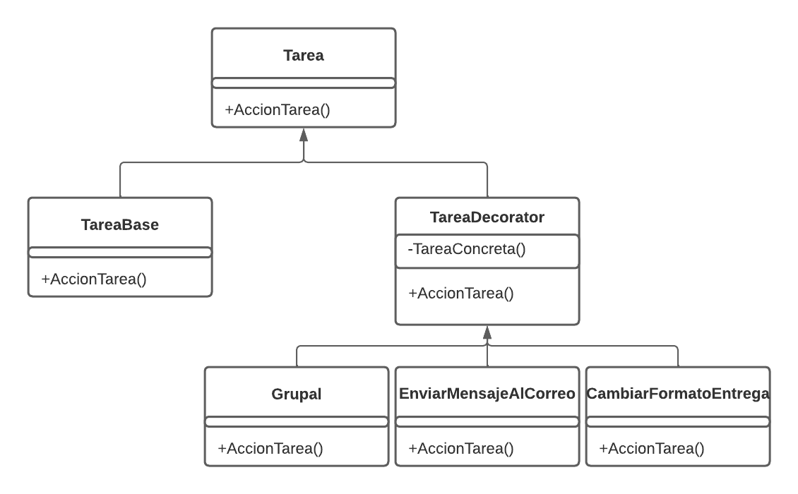

# Decorator Pattern

## Descripción básica

Patrón de diseño el cual permite agregar funcionalidades por medio de objetos encapsuladores y sin utilizar herencia. Este también es conocido como "Wrapper".

## Problema 

A la hora de diseñar un programa o un sistema de software se puede llegar al punto en el que se quiere crear un objeto abstracto, del que heredan otros objetos con distintas funcionalidades entre sí. El problema llega cuando se empiezan a buscar combinaciones entre objetos con distintas funcionalidades, ya que, dependiendo de la cantidad de características, las variantes pueden llegar a ser muy grande por lo que la cantidad de clases u objetos también aumentarían en cantidad y haría el código más largo y complejo.

A continuación, se presentan 2 ejemplos para explicar bien una situación clara de un problema:


Imagen 1 (Shvets, Alexander, 2021)


Imagen 2 (Shvets, Alexander, 2021)

## Solución

Para solucionar el problema anterior se crea un componente base a las que se le agregan decoradores que también se comportan como componentes. Esto va a hacer que al final los objetos se comporten como una cebolla a la que se le puede agregar más capas que representan los decoradores.

Se solucionan distintos problemas tales como:
- La herencia es estática.
- Las clases sólo pueden tener una clase padre.

### Estructura del patrón

Los componentes del patrón son:

1. Componente (interfaz): Es la interfaz común entre el objeto siendo decorado y las decoraciones.
2. Componente concreto: Es el objeto base, el cual va a ser modificado o se le van a agregar las decoraciones conforme se requiera.
3. Decorator: Es una clase abstracta que define lo mínimo para ser un decorador de la que heredan los decoradores.
4. Decorator concreto: Son los decoradores concretos que heredan de la clase Decorator y agregan las características o funcionalidades.


Imagen 3 (Dofactory, s.f.)

## Ejemplo en código

A continuación, un ejemplo en código del patrón decorator con comentarios que explican los diferentes métodos y clases. 

```c++
/**
 * La interfaz de componentes básica se encarga únicamente 
 * de definir los métodos que los decoradores pueden sobrecargar
 * decorators.
 */
class Component {
 public:
  virtual ~Component() {}
  virtual std::string Operation() const = 0;
};
/**
 * Los componentes concretos proveen una implementación "default" 
 * o por defecto de las operaciones.
 * 
 */
class ConcreteComponent : public Component {
 public:
  std::string Operation() const override {
    return "Soy el componente concreto:)";
  }
};
/**
 * El principal propósito de esta clase es 
 * definir la interfaz de encapsulación para todos los
 * decoradores concretos.
 */
class Decorator : public Component {
  /**
   * @var Component
   */
 protected:
  Component* component_;

 public:
  Decorator(Component* component) : component_(component) {
  }
  /**
  * El  decorador base le delega todo el trabajo al decorador concreto.
   */
  std::string Operation() const override {
    return this->component_->Operation();
  }
};
/**
 * Los decoradores concretos modifican el objeto de alguna forma.
 */
class ConcreteDecoratorA : public Decorator {
  /**
   * Los decoradores pueden llamar métodos del componente concreto, en vez de llamar
   * directamente al objeto envuelto.
   */
 public:
  ConcreteDecoratorA(Component* component) : Decorator(component) {
  }
  std::string Operation() const override {
    return "ConcreteDecoratorA(" + Decorator::Operation() + ")";
  }
};
/**
 * Decorators can execute their behavior either before or after the call to a
 * wrapped object. ?
 */
class ConcreteDecoratorB : public Decorator {
 public:
  ConcreteDecoratorB(Component* component) : Decorator(component) {
  }

  std::string Operation() const override {
    return "ConcreteDecoratorB(" + Decorator::Operation() + ")";
  }
};
/**
 * El codigo cliente funciona con la interfaz de componente, por lo que puede mantenerse
 * independiente a los componentes concretos con los que trabaja.
 * 
 */
void ClientCode(Component* component) {
  // ...
  std::cout << "RESULT: " << component->Operation();
  // ...
}

int main() {
  Component* simple = new ConcreteComponent;
  std::cout << "Cliente: Unicamente tengo la operacion por defecto:\n";
  ClientCode(simple);
  std::cout << "\n\n";
  Component* decorator1 = new ConcreteDecoratorA(simple);
  Component* decorator2 = new ConcreteDecoratorB(decorator1);
  std::cout << "Client: Ahora pase por decoradores, soy mejor:\n";
  ClientCode(decorator2);
  std::cout << "\n";
  delete simple;
  delete decorator1;
  delete decorator2;
  return 0;
}
```


## Consecuencias
### Positivas:

+ Se puede modificar el resultado de un objeto sin crear una subclase nueva, lo que reduce el código y lo simplifica. 

+ Se puede crear o quitar tareas de un objeto durante el tiempo de ejecución. 

+ Se pueden agregar varios comportamientos o características a un objeto base utilizando varios decoradores.

+ Cumple con el principio de responsabilidad única. Lo que nos permite separar código y modificar una clase monolítica la cual tiene muchas variantes que pueden influenciar el objeto final, en clases más pequeñas.

### Negativas:

+ Al crear muchos decoradores, el código se puede sobre complicar en vez de hacer más sencillo.
+ Como los decoradores pueden funcionar sin editar el código fuente, muchas veces se desconoce que está haciendo realmente un decorador y se pueden agregar funciones en el código fuente que un decorador ya había implementado previamente.
+ Crear casos de prueba para todos los diferentes decoradores puede llegar a ser muy extenso.

## relación con otros patrones

Relación con otros patrones

+ Composite
+ Adapter
+ Strategy
+ Proxy

## Ejemplo mediación virtual

En el siguiente diagrama de clases se logra ver como seria implementar el patrón decorator en mediación virtual para agregar o quitarle funcionalidades a las tareas.


Imagen 4 (Esteban Rojas, 2023)

## Referencias

Shvets, Alexander. (2021) Decorator. https://refactoring.guru/es/design-patterns/decorator

C# Decorator Design Pattern - Dofactory. (s. f.). https://www.dofactory.com/net/decorator-design-pattern
